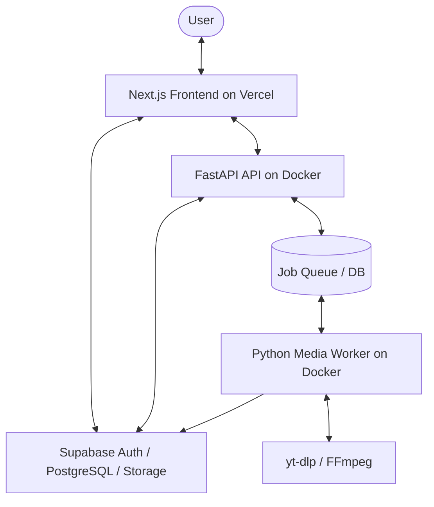

# Media Loader

[](https://nextjs.org)
[](https://fastapi.tiangolo.com)
[](https://supabase.com)
[](https://www.docker.com)
[](#)

A premium, private, rights-aware media utility workspace built for personal daily use. Analyze media URLs, select quality/formats, queue download/conversion tasks, and manage files securely via a modern command-center dark interface.

This application is architected with a decoupled monorepo approach: Next.js on Vercel, Supabase for auth/data, and Python backend services (FastAPI & Worker) running inside Docker.

---

## Architecture Flow



---

## Core Product Flow

Every media request must pass through a strict security and policy layer before execution:

```text
URL Input ──> URL Validation ──> Policy Check ──> Analysis ──> Rights Confirmation ──> Job Queue ──> Worker Processing
```

> [!IMPORTANT]
> **No Bypass Policy**: Media Loader does NOT bypass DRM, login walls, or platform protections. It enforces rights checking at the policy layer.

---

## Key Features

### 💻 User Command Center
* **Modern Dark UI**: Clean, minimal, dashboard-style interface with sharp typography (Inter/Outfit) and responsive layouts.
* **Google OAuth**: Integrated authentication flow utilizing Supabase Auth.
* **Workspace Navigation**: Dashboard, Job Queue Tracker, Download History, and Account Management.

### 🔍 Smart URL Analyzer
* **SSR-safe Validation**: Protection against server-side request forgery (SSRF).
* **Metadata Extraction**: Live formatting lists, size estimates, and quality previews.
* **Platform Parsing**: Automatic domain recognition with localized custom parsers.

### ⚡ Distributed Processing
* **Decoupled Worker**: Heavy operations (downloads, FFmpeg transcoding) run isolated from the web-server.
* **Format Selector**: Multi-option download target (e.g., 1080p, 720p, or Audio extraction to MP3).
* **Speed & Progress Logs**: Real-time progress updates with speed tracking (`0002_add_download_speed.sql`).

### 🔒 Privacy & Safety
* **Zero-Secret Leakage**: Strict protocol preventing console logs or repository commits of credentials.
* **RLS Policies**: Postgres-level Row Level Security securing user data.
* **Automatic Cleanup**: Temporary files are cleared after a safe duration.

---

## Tech Stack

| Component | Technology | Description |
| :--- | :--- | :--- |
| **Frontend** | Next.js 16 (App Router), TS, TailwindCSS | Monorepo root `apps/web` |
| **Styling** | Vanilla CSS Variable Tokens, shadcn/ui | UI component system |
| **Database** | PostgreSQL (Supabase) | Core schema, profiles, jobs & policies |
| **Auth** | Supabase Auth (Google Provider) | Secure user access & token session validation |
| **Backend API** | FastAPI, Uvicorn, Python 3.11 | REST endpoints, token validation, policy execution |
| **Worker** | Python 3.11, Docker container | Daemon pulling queued jobs |
| **Media Tools** | yt-dlp (restricted mode), FFmpeg | Core extraction and conversion engines |
| **Deployment** | Vercel (Frontend), Docker Compose (Backend) | Production Vercel config & Dev setup |

---

## Repository Structure

This workspace is managed as a **pnpm monorepo**:

```text
media-loader/
├── apps/
│   ├── web/                 # Next.js Frontend (Vercel deployment)
│   ├── api/                 # FastAPI Backend Service (Docker container)
│   └── worker/              # Python processing worker (Docker container)
├── supabase/
│   ├── schema.sql           # Database structures
│   ├── rls_policies.sql     # Row level security scripts
│   └── migrations/          # Version-controlled migrations
├── docs/                    # Technical specs, roadmaps, and guides
│   ├── ARCHITECTURE.md      # Detailed system blueprint
│   ├── USER_SETUP_GUIDE.md  # Local and cloud environment instructions
│   └── VERCEL_SETUP.md      # Step-by-step Vercel host instructions
├── docker-compose.yml       # Local dev stack orchestra config
├── pnpm-workspace.yaml      # Monorepo workspace configuration
├── AGENTS.md                # Agent instruction & project rules
└── TODO.md                  # Development roadmap and shipping checklist
```

---

## Getting Started

Follow these steps to run the complete workspace locally.

### 1. Prerequisites
Ensure you have the following installed:
* [Docker & Docker Compose](https://www.docker.com/)
* [Node.js & pnpm](https://nodejs.org/)

### 2. Configuration & Secrets
Copy the environment template and fill in the values:
```bash
cp .env.example .env.local
```
> [!WARNING]
> Never commit `.env.local` or raw credentials to the repository. Only write credentials to local config files.

Refer to [docs/USER_SETUP_GUIDE.md](file:///d:/media-loader/docs/USER_SETUP_GUIDE.md) for generating Supabase & Google OAuth credentials.

### 3. Deploy Supabase Migrations
Apply schemas to your Supabase instance:
```bash
# Apply migrations located in supabase/migrations/
```

### 4. Start Backend Stack (Docker)
Launch the API and Worker containers:
```bash
docker compose up -d --build
```
This runs the FastAPI gateway at `http://localhost:8000` and initializes the media worker queue listener.

### 5. Start Frontend Server
Navigate to the web app, install dependencies, and run the Next.js dev server:
```bash
pnpm install
pnpm run dev:web
```
Open `http://localhost:3000` to access the application dashboard.

---

## Production Deployment

### Frontend (Vercel)
The root `vercel.json` coordinates monorepo building:
1. Import repository to Vercel.
2. Build Settings:
   - Framework Preset: **Next.js**
   - Build Command: `cd apps/web && pnpm build`
   - Output Directory: `apps/web/.next`
3. Environment Variables:
   - `NEXT_PUBLIC_SUPABASE_URL`
   - `NEXT_PUBLIC_SUPABASE_ANON_KEY`
   - `NEXT_PUBLIC_FASTAPI_BASE_URL` (points to your deployed backend API)

For step-by-step configuration, check [docs/VERCEL_SETUP.md](file:///d:/media-loader/docs/VERCEL_SETUP.md).

### Backend (Docker Container)
Deploy the `apps/api` and `apps/worker` containers to cloud providers like Railway, Fly.io, or AWS ECS.

---

## License & Policy
* **Private Codebase**: Intended for personal use only.
* **Rights Compliance**: Respect platform Terms of Service. Avoid scraping or accessing restricted materials.
