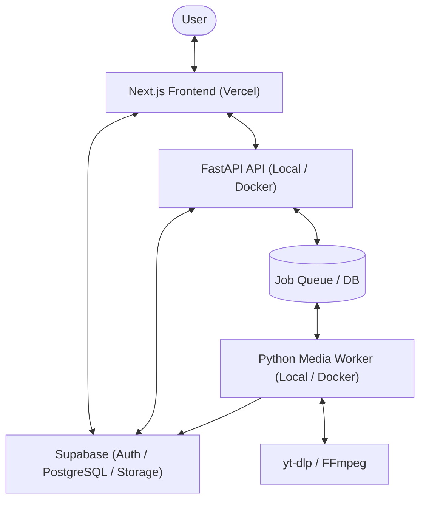

# Media Loader

[](https://nextjs.org)
[](https://fastapi.tiangolo.com)
[](https://supabase.com)
[](https://www.docker.com)
[](#)

> **Language / ภาษา:** [🇺🇸 English](#-english) | [🇹🇭 ภาษาไทย](#-ภาษาไทย)

---

<details open>
<summary><h2 id="-english" style="display:inline-block">🇺🇸 English</h2></summary>

A premium, private, rights-aware media downloader & converter application built for personal daily use. Analyze media URLs, select video/audio quality, queue download/conversion tasks, and manage files securely via a modern dark command-center interface.

### Quick Start

Get the entire monorepo stack running locally in 3 simple steps:

#### 1. Prerequisites
Ensure you have Node.js (v18+), pnpm (`npm install -g pnpm`), Python 3.12+, uv, and FFmpeg installed.

#### 2. Setup Environment & Dependencies
```bash
# 1. Copy environment template
cp .env.example .env.local

# 2. Install Node & Python dependencies (from root)
pnpm install
pnpm setup:py
```

#### 3. Run Development Servers
Open 3 terminal windows at the repository root:

| Terminal | Command | Service & URL |
| :--- | :--- | :--- |
| **Terminal 1** | `pnpm dev:web` | **Next.js Web UI** → `http://localhost:3000` |
| **Terminal 2** | `pnpm dev:api` | **FastAPI Backend** → `http://localhost:8000` |
| **Terminal 3** | `pnpm dev:worker` | **Python Media Worker** |

> [!TIP]
> Run `pnpm check-env` at any time to validate your environment configuration without leaking secret values.

### Key Features

* **Command Center UI**: Modern dark dashboard with sharp typography (Inter/Outfit), responsive design, and Google OAuth login via Supabase Auth.
* **Smart URL Analyzer**: SSRF-safe URL validation, live format extraction, size estimation, and quality previews.
* **Decoupled Media Processing**: Isolated daemon worker handling downloads and FFmpeg audio/video transcoding with real-time speed tracking.
* **Privacy & Rights Guard**: Strict non-bypass policy enforcing rights checks, Postgres Row Level Security (RLS), and zero-secret leakage protocols.

### Architecture



### Tech Stack

| Layer | Technology | Monorepo Path |
| :--- | :--- | :--- |
| **Frontend** | Next.js 16 (App Router), TypeScript, TailwindCSS | [`apps/web`](apps/web) |
| **Backend API** | FastAPI, Uvicorn, Python 3.12 | [`apps/api`](apps/api) |
| **Media Worker** | Python 3.12, yt-dlp, FFmpeg | [`apps/worker`](apps/worker) |
| **Database & Auth**| Supabase PostgreSQL, Supabase Auth | [`supabase`](supabase) |
| **Tooling** | `pnpm` (Node.js), `uv` (Python) | Monorepo Root |

### Documentation & Guides

Detailed guides are available in the [`docs/en/`](docs/en/DEVELOPER_GUIDE.md) directory:

* **[Developer Onboarding Guide](docs/en/DEVELOPER_GUIDE.md)** — Comprehensive architecture, command reference, sequence flow, and doc index.
* **[User Setup Guide](docs/en/USER_SETUP_GUIDE.md)** — Step-by-step Supabase & Google OAuth credentials setup.
* **[System Architecture](docs/en/ARCHITECTURE.md)** — In-depth blueprint, security boundary, and data flows.
* **[Vercel Deployment Guide](docs/en/VERCEL_SETUP.md)** — Host the frontend monorepo on Vercel.
* **[Secrets Protocol](docs/en/SECRETS_PROTOCOL.md)** — Zero-leakage protocol guidelines for developers and AI agents.

### License & Policy

* **Private Repository**: For personal use only.
* **Rights Compliance**: Respects platform Terms of Service and enforces rights checking at the policy layer.

</details>

---

<details open>
<summary><h2 id="-ภาษาไทย" style="display:inline-block">🇹🇭 ภาษาไทย</h2></summary>

เว็บแอปพลิเคชันดาวน์โหลดและแปลงไฟล์วิดีโอ/เสียงส่วนตัวระดับพรีเมียม (Private Media Downloader & Converter) ที่เคารพสิทธิ์และออกแบบมาสำหรับการใช้งานประจำวัน วิเคราะห์ URL สื่อ, เลือกความละเอียดและฟอร์แมตวิดีโอ/เสียง, คิวงานดาวน์โหลดและแปลงไฟล์, และจัดการไฟล์ย้อนหลังได้อย่างปลอดภัยผ่านอินเทอร์เฟซโทนเข้มสไตล์ Command-Center ที่ทันสมัย

### การเริ่มต้นใช้งานด่วน (Quick Start)

เริ่มต้นรันระบบทั้ง Monorepo บนเครื่อง Local ได้ง่ายๆ ใน 3 ขั้นตอน:

#### 1. สิ่งที่ต้องเตรียม (Prerequisites)
ตรวจสอบให้แน่ใจว่าติดตั้ง Node.js (v18+), pnpm (`npm install -g pnpm`), Python 3.12+, uv, และ FFmpeg บนเครื่องแล้ว

#### 2. ตั้งค่าไฟล์ Environment & ติดตั้ง Dependencies
```bash
# 1. คัดลอกแม่แบบไฟล์ Environment
cp .env.example .env.local

# 2. ติดตั้ง Dependencies ของทั้ง Node.js และ Python (รันจาก Root)
pnpm install
pnpm setup:py
```

#### 3. สั่งรันบริการ (Development Servers)
เปิด 3 หน้าต่าง Terminal ที่ Root โฟลเดอร์ของโปรเจกต์:

| Terminal | คำสั่ง (Command) | บริการและ URL |
| :--- | :--- | :--- |
| **Terminal 1** | `pnpm dev:web` | **Next.js Web UI** → `http://localhost:3000` |
| **Terminal 2** | `pnpm dev:api` | **FastAPI Backend** → `http://localhost:8000` |
| **Terminal 3** | `pnpm dev:worker` | **Python Media Worker** |

> [!TIP]
> สั่งรัน `pnpm check-env` ได้ตลอดเวลาเพื่อตรวจสอบความถูกต้องของค่าแปรสภาพแวดล้อมโดยไม่พิมพ์รหัสลับออกมา

### ฟีเจอร์หลัก (Key Features)

* **ศูนย์ควบคุมผู้ใช้ (Command Center UI)**: อินเทอร์เฟซ Dashboard โทนเข้มที่สะอาด มินิมอล พร้อมระบบล็อกอิน Google OAuth ผ่าน Supabase Auth
* **ระบบวิเคราะห์ URL อัจฉริยะ (Smart URL Analyzer)**: ป้องกัน SSRF, ดึงข้อมูลเมตาสด, ประเมินขนาดไฟล์ และแสดงตัวอย่างความละเอียด
* **ระบบประมวลผลแยกอิสระ (Decoupled Processing)**: Worker Daemon สำหรับงานดาวน์โหลดและแปลงไฟล์ด้วย FFmpeg พร้อมติดตามความเร็วแบบเรียลไทม์
* **ความเป็นส่วนตัวและการเคารพสิทธิ์ (Privacy & Rights Guard)**: นโยบายไม่ข้ามระบบป้องกัน, กำหนดสิทธิ์ระดับตารางด้วย Postgres RLS และป้องกันรหัสผ่านหลุดอย่างเข้มงวด

### เทคโนโลยีที่ใช้ (Tech Stack)

| เลเยอร์ (Layer) | เทคโนโลยี (Technology) | โครงสร้างใน Monorepo |
| :--- | :--- | :--- |
| **Frontend** | Next.js 16 (App Router), TypeScript, TailwindCSS | [`apps/web`](apps/web) |
| **Backend API** | FastAPI, Uvicorn, Python 3.12 | [`apps/api`](apps/api) |
| **Media Worker** | Python 3.12, yt-dlp, FFmpeg | [`apps/worker`](apps/worker) |
| **Database & Auth**| Supabase PostgreSQL, Supabase Auth | [`supabase`](supabase) |
| **Tooling** | `pnpm` (Node.js), `uv` (Python) | Monorepo Root |

### คู่มือการใช้งานและเอกสารฉบับเต็ม (Documentation & Guides)

ดูรายละเอียดการตั้งค่าเชิงลึกได้ที่ไดเรกทอรี [`docs/th/`](docs/th/DEVELOPER_GUIDE.md):

* **[คู่มือภาพรวมสำหรับนักพัฒนา](docs/th/DEVELOPER_GUIDE.md)** — สถาปัตยกรรมระบบ, Sequence Diagram, รวมคำสั่ง และดัชนีเอกสารทั้งหมด
* **[คู่มือการติดตั้งสภาพแวดล้อม](docs/th/USER_SETUP_GUIDE.md)** — ขั้นตอนการขอ Supabase & Google OAuth Keys ทีละขั้นตอน
* **[ข้อกำหนดสถาปัตยกรรมระบบ](docs/th/ARCHITECTURE.md)** — ผังระบบโดยละเอียด ขอบเขตความปลอดภัย และการไหลของข้อมูล
* **[คู่มือการ deploy บน Vercel](docs/th/VERCEL_SETUP.md)** — การตั้งค่า Next.js Monorepo ขึ้น Vercel
* **[โปรโตคอลความปลอดภัย](docs/th/SECRETS_PROTOCOL.md)** — แนวปฏิบัติการดูแลความลับและป้องกันรหัสหลุด

### สิทธิ์การใช้งานและนโยบาย (License & Policy)

* **Private Repository**: สำหรับการใช้งานส่วนบุคคลเท่านั้น
* **Rights Compliance**: เคารพเงื่อนไขการให้บริการ (Terms of Service) ของแต่ละแพลตฟอร์ม และบังคับใช้การตรวจสอบสิทธิ์ในชั้นนโยบาย

</details>
