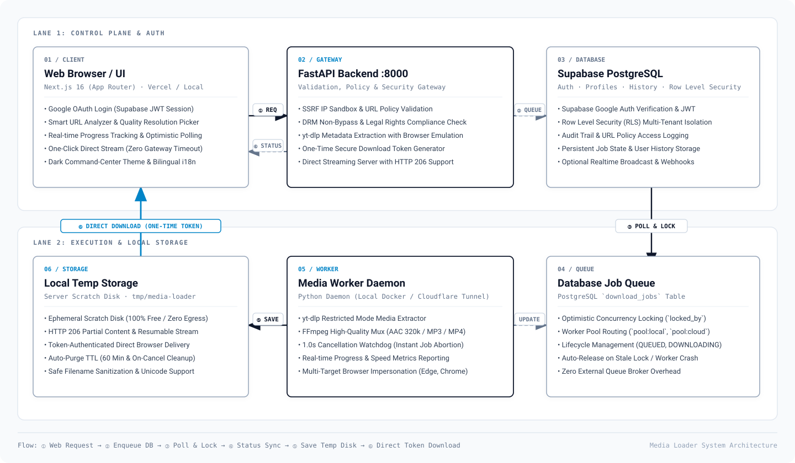

# Media Loader

<p align="center">
  
</p>

<p align="center"><strong>ประมวลผลสื่อสำหรับใช้งานส่วนบุคคลโดยเคารพสิทธิ์</strong></p>

<p align="center">
  วิเคราะห์ URL สื่อที่รองรับ ตรวจสอบรูปแบบไฟล์ คิวงานที่ได้รับอนุญาต
  และจัดการไฟล์ที่ประมวลผลเสร็จแล้วผ่านเว็บแอปเดียว
</p>

<p align="center">
  <a href="docs/th/DEVELOPER_GUIDE.md">คู่มือนักพัฒนา</a> ·
  <a href="docs/th/ARCHITECTURE.md">สถาปัตยกรรม</a> ·
  <a href="docs/th/VERCEL_SETUP.md">การติดตั้ง</a> ·
  <a href="SECURITY.md">ความปลอดภัย</a>
</p>

<p align="center"><a href="README.md">English</a> · <strong>ภาษาไทย</strong></p>

---

## ภาพรวม

Media Loader เป็นเว็บแอปสำหรับวิเคราะห์ URL สื่อที่เข้าเงื่อนไขและจัดการงาน
ประมวลผลที่ผู้ใช้มีสิทธิ์ดำเนินการ เว็บแอปส่งคำขอไปยัง API ที่ตรวจสอบนโยบาย
ส่วน Worker แยกต่างหากรับผิดชอบงานประมวลผลสื่อ โดยใช้ Supabase สำหรับการยืนยันตัวตน
และจัดเก็บข้อมูลใน PostgreSQL

ระบบทำงานตามลำดับที่คำนึงถึงสิทธิ์:

```text
กรอก URL → ตรวจสอบความถูกต้อง → ตรวจสอบนโยบาย → วิเคราะห์ → ยืนยันสิทธิ์ → เข้าคิว → Worker
```

## หลักการ

- **เคารพสิทธิ์และมาตรการควบคุมการเข้าถึง** ประมวลผลเฉพาะสื่อที่คุณมีสิทธิ์
  และไม่ข้าม DRM, หน้าเข้าสู่ระบบ หรือมาตรการป้องกันอื่น
- **แยกหน้าที่ของแต่ละบริการ** API ตรวจสอบ URL และนโยบาย, Worker ประมวลผลสื่อ
  และเว็บแอปทำหน้าที่แสดงส่วนติดต่อผู้ใช้
- **ปกป้องข้อมูลผู้ใช้** การทำงานของบัญชีที่เข้าสู่ระบบจะจำกัดขอบเขตตามผู้ใช้
  โดยมี Row Level Security (RLS) ของ PostgreSQL ช่วยแยกข้อมูล URL งานจะถูกเข้ารหัส
  ในฐานข้อมูล และ request ต้นทางจะส่งผ่าน egress proxy ที่ตรวจสอบปลายทาง

## สถาปัตยกรรม

| องค์ประกอบ | หน้าที่ | การนำไปใช้งาน |
| --- | --- | --- |
| `apps/web` | เว็บแอป Next.js | Vercel |
| `apps/api` | วิเคราะห์ URL ตรวจสอบนโยบาย และสร้างงาน | โฮสต์แยกใน container |
| `apps/worker` | ตรวจคิวและประมวลผลสื่อด้วย yt-dlp และ FFmpeg | โฮสต์ Worker ที่ใช้ output volume ร่วมกับ API |
| `apps/proxy` | Public-IP egress proxy สำหรับ request ต้นทาง | เครือข่าย Backend แบบ private |
| `supabase` | การยืนยันตัวตน, PostgreSQL และ Row Level Security | Supabase |

Vercel ใช้โฮสต์เฉพาะ Frontend ส่วน API และ Worker ทำงานแยกต่างหาก โดย Worker
ไม่ได้ทำงานภายใน Vercel Functions ในโหมด `local_temp` ค่าเริ่มต้น API และ Worker
ต้องใช้ output volume เดียวกัน

<p align="center">
  <a href="docs/diagrams/media-loader-architecture.svg">
    
  </a>
</p>

## เริ่มต้นใช้งาน

### สิ่งที่ต้องเตรียม

- Node.js 22.13 ขึ้นไป และ pnpm 11 ขึ้นไป
- Python 3.12 และ `uv`
- FFmpeg
- การตั้งค่าโปรเจกต์ Supabase สำหรับบริการที่ต้องการใช้งาน

### ติดตั้ง dependencies

รันคำสั่งต่อไปนี้จากไดเรกทอรีหลักของ repository:

```bash
pnpm install
pnpm setup:py
```

### ตั้งค่าสภาพแวดล้อม

สร้างไฟล์สภาพแวดล้อมในเครื่องจากไฟล์ตัวอย่าง และกำหนดค่าตาม
[คู่มือตัวแปรสภาพแวดล้อม](docs/th/ENVIRONMENT_VARIABLES.md)

```bash
# macOS และ Linux
cp .env.example .env.local

# PowerShell
Copy-Item .env.example .env.local
```

ตรวจสอบการตั้งค่าด้วย `pnpm check-env` และเก็บไฟล์สภาพแวดล้อมในเครื่องกับข้อมูลรับรอง
ให้พ้นจาก version control ตั้ง `MEDIA_URL_ENCRYPTION_KEY` เป็น Fernet key
ค่าเดียวกันให้ API และ Worker และกำหนด `MEDIA_EGRESS_PROXY` ตามคู่มือ environment

### เริ่มระบบ

เปิดเว็บแอป API, Worker และ egress proxy จากไดเรกทอรีหลัก:

```bash
pnpm dev
```

เว็บแอปจะทำงานที่ `http://localhost:3000` และ API ที่ `http://localhost:8000`
ดูคำสั่งและรายละเอียดการตั้งค่าแยกตามบริการได้ใน
[คู่มือนักพัฒนา](docs/th/DEVELOPER_GUIDE.md)

## คำสั่งสำหรับพัฒนา

| คำสั่ง | การทำงาน |
| --- | --- |
| `pnpm dev` | เริ่มเว็บแอป API, Worker และ egress proxy สำหรับพัฒนาในเครื่อง |
| `pnpm dev:web` | เริ่มเฉพาะเว็บแอป Next.js |
| `pnpm dev:api` | เริ่มเฉพาะบริการ FastAPI |
| `pnpm dev:worker` | เริ่มเฉพาะ Media Worker |
| `pnpm dev:proxy` | เริ่มเฉพาะ SSRF egress proxy ที่ `127.0.0.1:3128` |
| `pnpm lint` | ตรวจ lint ทั่วทั้ง repository |
| `pnpm deadcode` | ตรวจหาโค้ดที่ไม่ได้ใช้งาน |
| `pnpm build` | สร้าง build ของเว็บแอป Next.js |
| `pnpm test:web` | รันทดสอบเว็บแอป |
| `pnpm test:api` | รันทดสอบ API |
| `pnpm test:worker` | รันทดสอบ Worker |
| `pnpm test:proxy` | รันทดสอบ egress proxy |

## เอกสาร

- [คู่มือเริ่มต้นใช้งาน](docs/th/USER_SETUP_GUIDE.md)
- [คู่มือนักพัฒนา](docs/th/DEVELOPER_GUIDE.md)
- [สถาปัตยกรรมระบบ](docs/th/ARCHITECTURE.md)
- [ข้อกำหนด API](docs/th/API_SPEC.md)
- [โครงสร้างฐานข้อมูล](docs/th/DATABASE_SCHEMA.md)
- [นโยบายความปลอดภัยและการใช้สื่อ](docs/th/SECURITY_AND_POLICY.md)
- [นโยบาย Row Level Security ของ Supabase](docs/th/SUPABASE_RLS_POLICY.md)
- [ตัวแปรสภาพแวดล้อม](docs/th/ENVIRONMENT_VARIABLES.md)
- [คู่มือตั้งค่า Google OAuth](docs/th/GOOGLE_OAUTH_SETUP.md)
- [แนวทางจัดการข้อมูลลับ](docs/th/SECRETS_PROTOCOL.md)
- [การติดตั้งบน Vercel](docs/th/VERCEL_SETUP.md)
- [การตั้งค่า Cloudflare Tunnel](docs/th/CLOUDFLARE_TUNNEL_GUIDE.md)
- [แนวทางการร่วมพัฒนา (ภาษาอังกฤษ)](CONTRIBUTING.md)
- [นโยบายความปลอดภัย (ภาษาอังกฤษ)](SECURITY.md)
- [MIT License](LICENSE)

## การใช้งานอย่างรับผิดชอบ

ใช้ Media Loader กับสื่อที่คุณได้รับอนุญาตให้ประมวลผลเท่านั้น และปฏิบัติตาม
กฎหมายกับเงื่อนไขการให้บริการของแพลตฟอร์มที่เกี่ยวข้อง แอปไม่ใช้ browser cookies
เพื่อเข้าถึงเนื้อหาที่จำกัดสิทธิ์ และไม่มีฟังก์ชันสำหรับข้ามมาตรการป้องกัน
