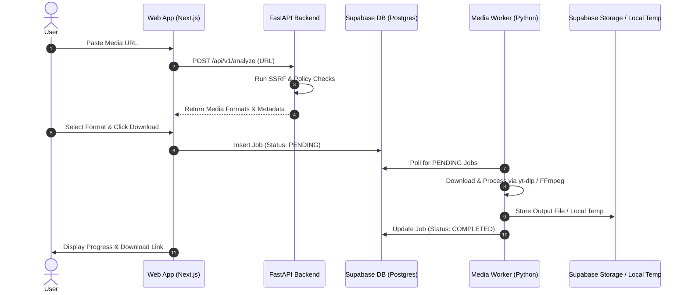

# Developer Onboarding & Architecture Guide

[English](DEVELOPER_GUIDE.md) | [ภาษาไทย](../th/DEVELOPER_GUIDE.md)

Welcome to the Media Loader developer documentation hub. This guide provides a comprehensive overview for developers working on or contributing to the codebase.

---

## 1. Project Architecture Overview

Media Loader is structured as a decoupled monorepo:

```text
media-loader/
├── apps/
│   ├── web/                 # Next.js 16 Frontend (App Router, Tailwind, Drizzle)
│   ├── api/                 # FastAPI Backend Service (URL analysis & Policy engine)
│   └── worker/              # Python Media Worker (Queue listener, yt-dlp, FFmpeg)
├── supabase/
│   ├── schema.sql           # Core PostgreSQL database schema
│   ├── rls_policies.sql     # Supabase Row Level Security scripts
│   └── migrations/          # Version-controlled database migrations
└── docs/                    # Architectural specs and setup guides
```

### Data Flow Diagram



---

## 2. Developer Command Reference

All primary development tasks can be run directly from the repository root directory using `pnpm`:

### Environment & Dependencies
```bash
# Copy local environment template
cp .env.example .env.local

# Install Node & Python dependencies across monorepo
pnpm install
pnpm setup:py

# Validate environment variables without printing secrets
pnpm check-env
```

### Running Local Development Servers
```bash
# Terminal 1: Web Frontend (http://localhost:3000)
pnpm dev:web

# Terminal 2: FastAPI Backend (http://localhost:8000)
pnpm dev:api

# Terminal 3: Python Media Worker
pnpm dev:worker
```

### Database Operations (Drizzle ORM)
```bash
# Push schema updates to Supabase / PostgreSQL
pnpm --filter web db:push
```

---

## 3. Documentation Index

Detailed domain-specific specifications are available in this directory:

| Document | Purpose |
| :--- | :--- |
| **[USER_SETUP_GUIDE.md](USER_SETUP_GUIDE.md)** | Step-by-step instructions for getting credentials from Supabase & Google Cloud. |
| **[ARCHITECTURE.md](ARCHITECTURE.md)** | Complete system design, component boundaries, and security model. |
| **[API_SPEC.md](API_SPEC.md)** | FastAPI REST API endpoints, request schemas, and response formats. |
| **[DATABASE_SCHEMA.md](DATABASE_SCHEMA.md)** | Database tables, relationships, status models, and Drizzle ORM setup. |
| **[SECURITY_AND_POLICY.md](SECURITY_AND_POLICY.md)** | Non-bypass rights validation rules, SSRF protection, and policy engine specs. |
| **[SUPABASE_RLS_POLICY.md](SUPABASE_RLS_POLICY.md)** | Row Level Security (RLS) policies for user data isolation. |
| **[ENVIRONMENT_VARIABLES.md](ENVIRONMENT_VARIABLES.md)** | Full listing of required and optional environment variables. |
| **[GOOGLE_OAUTH_SETUP.md](GOOGLE_OAUTH_SETUP.md)** | Guide to configuring Google OAuth in Supabase Dashboard. |
| **[VERCEL_SETUP.md](VERCEL_SETUP.md)** | Guide to deploying the Next.js frontend to Vercel. |
| **[SECRETS_PROTOCOL.md](SECRETS_PROTOCOL.md)** | Zero-secret leakage protocol for developers and AI agents. |

---

## 4. Status Model Lifecycle

Jobs in Media Loader follow a strict state transition flow:

```text
PENDING ──> ANALYZING ──> READY ──> QUEUED ──> DOWNLOADING ──> CONVERTING ──> UPLOADING ──> COMPLETED
                                                                                    └──> FAILED
                                                                                    └──> BLOCKED
                                                                                    └──> CANCELLED
```

---

## 5. Development Rules & Guidelines

1. **Package Managers**:
   - Always use `pnpm` for Node.js package management and script execution.
   - Always use `uv` for Python package installation, virtualenv management, and running Python scripts (`uv venv`, `uv pip install`, `uv run`).
2. **Secrets Handling**:
   - Never print or log secret credential values (e.g., `SUPABASE_SERVICE_ROLE_KEY`, `GOOGLE_CLIENT_SECRET`).
   - Never commit `.env.local` to git repository.
3. **Rights Compliance**:
   - Never implement DRM bypass, paywall bypass, or login-wall bypassing logic.
   - All URLs must pass policy validation before analysis or downloading.
