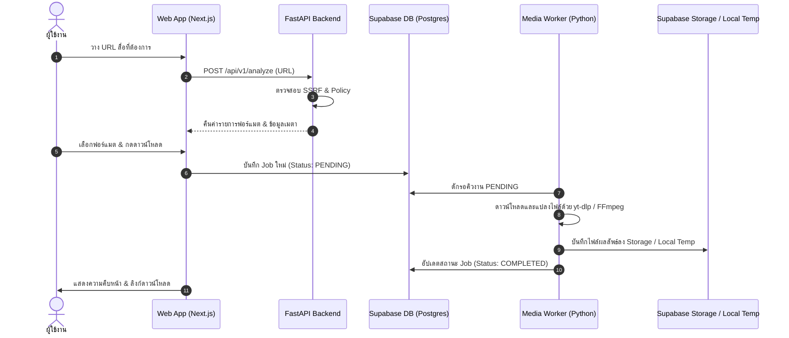

# คู่มือพัฒนาและผังสถาปัตยกรรมระบบ (Developer Onboarding & Architecture Guide)

ยินดีต้อนรับสู่ศูนย์รวมเอกสารสำหรับนักพัฒนา (Developer Documentation Hub) ของโปรเจกต์ Media Loader คู่มือนี้สรุปข้อมูลสถาปัตยกรรม คำสั่ง เครื่องมือ และข้อกำหนดที่จำเป็นสำหรับการพัฒนาและต่อยอดระบบ

---

## 1. ผังสถาปัตยกรรมโปรเจกต์ (Project Architecture Overview)

Media Loader ถูกออกแบบในรูปแบบ Decoupled Monorepo:

```text
media-loader/
├── apps/
│   ├── web/                 # Next.js 16 Frontend (App Router, Tailwind, Drizzle)
│   ├── api/                 # FastAPI Backend Service (URL analysis & Policy engine)
│   └── worker/              # Python Media Worker (Queue listener, yt-dlp, FFmpeg)
├── supabase/
│   ├── schema.sql           # โครงสร้างฐานข้อมูล PostgreSQL หลัก
│   ├── rls_policies.sql     # สคริปต์ Supabase Row Level Security
│   └── migrations/          # สคริปต์ Migration ตามระบบควบคุมเวอร์ชัน
└── docs/                    # คู่มือสถาปัตยกรรมและข้อกำหนดทางเทคนิค
```

### การไหลของข้อมูลในระบบ (Data Flow Diagram)



---

## 2. รวมคำสั่งสำคัญสำหรับนักพัฒนา (Developer Command Reference)

คำสั่งการพัฒนาหลักทั้งหมดสามารถรันได้โดยตรงจาก Root Directory ของโปรเจกต์ผ่าน `pnpm`:

### การจัดการสภาพแวดล้อมและ Dependencies
```bash
# คัดลอกแม่แบบไฟล์ Environment
cp .env.example .env.local

# ติดตั้ง Dependencies ของทั้ง Node.js และ Python ใน Monorepo
pnpm install
pnpm setup:py

# ตรวจสอบความถูกต้องของ Environment Variables โดยไม่พิมพ์รหัสลับออกมา
pnpm check-env
```

### การสั่งรันบริการ Local Development
```bash
# Terminal 1: Web Frontend (http://localhost:3000)
pnpm dev:web

# Terminal 2: FastAPI Backend (http://localhost:8000)
pnpm dev:api

# Terminal 3: Python Media Worker
pnpm dev:worker
```

### การจัดการฐานข้อมูล (Drizzle ORM)
```bash
# Push การอัปเดต Schema ไปยัง Supabase / PostgreSQL
pnpm --filter web db:push
```

---

## 3. ดัชนีเอกสารทางเทคนิค (Documentation Index)

รายละเอียดเชิงลึกของแต่ละส่วนงานสามารถอ่านเพิ่มเติมได้ในไดเรกทอรี [`docs/`](docs):

| เอกสาร | วัตถุประสงค์และเนื้อหา |
| :--- | :--- |
| **[USER_SETUP_GUIDE.md](USER_SETUP_GUIDE.md)** | ขั้นตอนการขอรหัสผ่านและสร้างคีย์จาก Supabase & Google Cloud |
| **[ARCHITECTURE.md](ARCHITECTURE.md)** | สถาปัตยกรรมระบบโดยละเอียด ขอบเขตความปลอดภัย และการไหลของข้อมูล |
| **[API_SPEC.md](API_SPEC.md)** | ข้อกำหนด REST API Endpoints ของ FastAPI, Request Schemas และ Response Formats |
| **[DATABASE_SCHEMA.md](DATABASE_SCHEMA.md)** | โครงสร้างตารางฐานข้อมูล ความสัมพันธ์ โมเดลสถานะ และการตั้งค่า Drizzle ORM |
| **[SECURITY_AND_POLICY.md](SECURITY_AND_POLICY.md)** | กฎการตรวจสอบสิทธิ์, การป้องกัน SSRF และข้อกำหนดของ Policy Engine |
| **[SUPABASE_RLS_POLICY.md](SUPABASE_RLS_POLICY.md)** | นโยบาย Row Level Security (RLS) สำหรับแยกแยะข้อมูลผู้ใช้ |
| **[ENVIRONMENT_VARIABLES.md](ENVIRONMENT_VARIABLES.md)** | รายการค่าแปรสภาพแวดล้อมทั้งหมดทั้งที่จำเป็นและตัวเลือกเสริม |
| **[GOOGLE_OAUTH_SETUP.md](GOOGLE_OAUTH_SETUP.md)** | คู่มือการตั้งค่า Google OAuth ใน Supabase Dashboard |
| **[VERCEL_SETUP.md](VERCEL_SETUP.md)** | คู่มือการ deploy ส่วนของ Next.js Frontend ขึ้น Vercel |
| **[SECRETS_PROTOCOL.md](SECRETS_PROTOCOL.md)** | โปรโตคอลความปลอดภัยและการจัดการรหัสผ่านสำหรับนักพัฒนาและ AI Agent |

---

## 4. วงจรสถานะงาน (Status Model Lifecycle)

คิวงานใน Media Loader เปลี่ยนสถานะตามลำดับขั้นตอนดังนี้:

```text
PENDING ──> ANALYZING ──> READY ──> QUEUED ──> DOWNLOADING ──> CONVERTING ──> UPLOADING ──> COMPLETED
                                                                                    └──> FAILED
                                                                                    └──> BLOCKED
                                                                                    └──> CANCELLED
```

---

## 5. กฎและแนวทางการพัฒนา (Development Rules)

1. **เครื่องมือจัดการ Package**:
   - ใช้ `pnpm` สำหรับ Node.js Packages และการรันสคริปต์ในโปรเจกต์เสมอ
   - ใช้ `uv` สำหรับการจัดการ Virtual Environment และรัน Python Scripts (`uv venv`, `uv pip install`, `uv run`) เสมอ
2. **การรักษาความลับ (Secrets Handling)**:
   - ห้ามพิมพ์หรือบันทึกรหัสผ่านลับลงใน Log หรือ Console (เช่น `SUPABASE_SERVICE_ROLE_KEY`, `GOOGLE_CLIENT_SECRET`)
   - ห้าม commit ไฟล์ `.env.local` ลงใน Git Repository
3. **การเคารพสิทธิ์และนโยบาย (Rights Compliance)**:
   - ห้ามเขียนโค้ดเพื่อข้ามระบบ DRM, Paywall หรือหน้าต่างล็อกอินของแพลตฟอร์มใดๆ
   - ทุก URL ต้องผ่านการตรวจสอบในชั้น Policy ก่อนวิเคราะห์หรือดาวน์โหลดเสมอ
